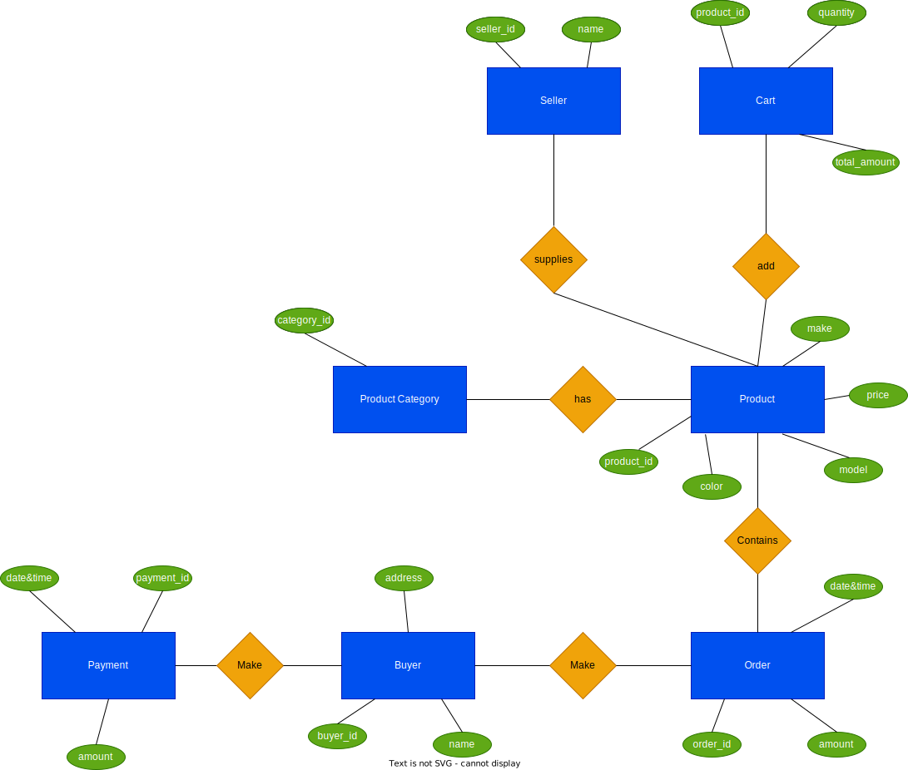

# shopping-cart-system

## User Stories

### User story for User

- As a user, I want to be able to search items by various attributes like category, model, make, etc. 

**Acceptance Criteria:**

1.Users do not need to be registered or logged in to search an item

2.As a user, I want to register to the portal

**Acceptance Criteria:**

1.Users should be able to provide their details to register.
2.After registration, user should be able to login to the system

- As a user, I want to login to the system

**Acceptance Criteria:**

1.Users should be able to enter their credentials to log in to the system
2.After successful login user should have the access to the features based on their role

### User story for Buyer

- As a buyer, I want to view and update the items in my shopping cart.

**Acceptance Criteria:**

1.Buyer should be registered user and logged in
2.Shopping cart should list all the items that buyer has added 
3.Shopping cart page should provide a way to proceed to the checkout page

- As a buyer, I want to buy an item from portal 

**Acceptance Criteria:**

1.Buyer should be registered user and logged in
2.Item should be added to the buyer’s shopping cart before proceeding to the checkout page

### User story for Seller

- As a seller, I want to add items to the portal so that I can sell them

**Acceptance Criteria:**

1.The seller must be a registered user
2.The item should have basic details like name, price, make, color, model
3.The seller should be able to add image of the item
**

- As a seller, I want to update the details of my items

**Acceptance Criteria:**

1.The seller must be a registered user
2.The seller should be able to update name, price, make, color, model and mark it as out of stock or not

- As a seller, I want to delete items from shopping portal

**Acceptance Criteria:**

1.The seller must be a registered user
2.The item should be removed from the portal and no longer visible to the users

- As a seller, I want to view all the items that I have added to the portal

**Acceptance Criteria:**

-1.The seller must be a registered user

## ER Diagram
