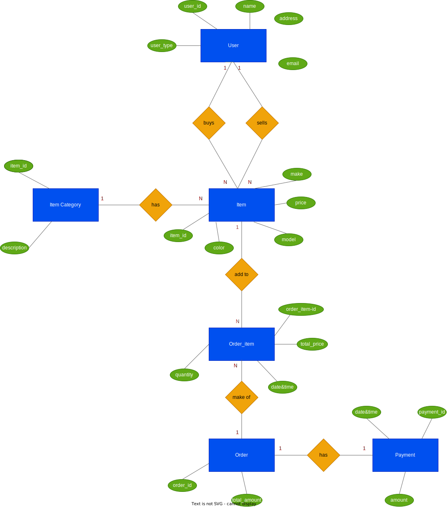

# shopping-cart-system

## User Stories

### User story for User

As a user, I want to be able to search items by various attributes like category, model, make, etc.\
**Acceptance Criteria:**
1. Users do not need to be registered or logged in to search an item

As a user, I want to register to the portal\
**Acceptance Criteria:**

1. Users should be able to provide their details to register.
2. After registration, user should be able to login to the system

As a user, I want to login to the system\
**Acceptance Criteria:**

1. Users should be able to enter their credentials to log in to the system
2. After successful login user should have the access to the features based on their role

### User story for Buyer

As a buyer, I want to view and update the items in my shopping cart.\
**Acceptance Criteria:**

1. Buyer should be registered user and logged in
2. Shopping cart should list all the items that buyer has added
3. Shopping cart page should provide a way to proceed to the checkout page

As a buyer, I want to buy an item from portal\
**Acceptance Criteria:**

1. Buyer should be registered user and logged in
2. Item should be added to the buyer's shopping cart before proceeding to the checkout page

### User story for Seller

As a seller, I want to add items to the portal so that I can sell them\
**Acceptance Criteria:**

1. The seller must be a registered user
2. The item should have basic details like name, price, make, color, model
3. The seller should be able to add image of the item

As a seller, I want to update the details of my items\
**Acceptance Criteria:**

1. The seller must be a registered user
2. The seller should be able to update name, price, make, color, model and mark it as out of stock or not

As a seller, I want to delete items from shopping portal\
**Acceptance Criteria:**

1. The seller must be a registered user
2. The item should be removed from the portal and no longer visible to the users

As a seller, I want to view all the items that I have added to the portal\
**Acceptance Criteria:**

1. The seller must be a registered user

## ER Diagram

## Wireframes

### Landing Page

### Registration Page

### Login Page

### Product Description Page

### Cart Page

## Tables for the system

1. User table
    * user_id
    * username
    * address
    * email
    * password
    * user_type
    
2. Item table
    * item_id
    * name
    * description
    * color
    * price
    * make
    * model
    * image_url
    * no_items_available
    * user_id (FK)
    * category_id (FK)

3. Order table
    * order_id
    * user_id (FK)
    * date&time
    * status
    * total_amount

4.  Order Items table   
    * order_items_id
    * order_id (FK)
    * item_id (FK)
    * quantity
    * total_price

5. Category table
    * category_id
    * name
    * description

6. Payment table
    * payment_id
    * order_id (FK)
    * amount
    * data&time
    * provider
    * status

<!-- ## End points for seller

1. Create seller account
    * POST api/sellers - create new seller
2. Get seller information
    * GET api/sellers/:id - get seller information by id
    * GET api/sellers/:id/items - get seller's item by id
3. Update seller information
    * PATCH /api/sellers/:id - update seller information.
4. Delete seller information
    * DELETE /api/sellers/:id - update seller information.
5. Add Item 
    * POST /api/sellers/:id/items - add a new item to the seller's items.
6. Get item information
    * GET /api/items/:id - get item information by ID.
    * GET /api/items/category - get items by category
    * GET /api/items/model - get items by model
    * GET /api/items/color - get items by color
7. Update item information
    * PATCH /api/items/:id - update item information.
8. Delete item
    * DELETE /api/items/:id - delete an item from the seller's item. -->
    

## End points in User Service

* POST /api/users - create new user
* GET /api/users/:id - get user information by id
* GET /api/users/:id/items - get user's item by id
* PATCH /api/users/:id - update user information.
* DELETE /api/users/:id - delete user information.
* POST /api/users/register - register a new user
* POST /api/users/login - user login
* POST /api/users/:id/items - add a new item to the user's items.

## End points in Item Service

* GET /api/items/:id - get item information by ID.
* GET /api/items/category - get items by category
* GET /api/items/model - get items by model
* GET /api/items/color - get items by color
* GET /api/items/:id/count - get number of available item by id
* PATCH /api/items/:id - update item information.
* DELETE /api/items/:id - delete an item from the user's item.

## End points in Order Service
* POST /api/orders - create new order
* GET /api/orders - get all orders
* GET /api/orders/:id - get order by id
* PUT /api/orders/:id - update order
* DELETE /api/orders/:id - Delete order

## End points in Payment Service
* POST /api/payments - process a payment
* GET /api/payments/:id - get payment details by id

